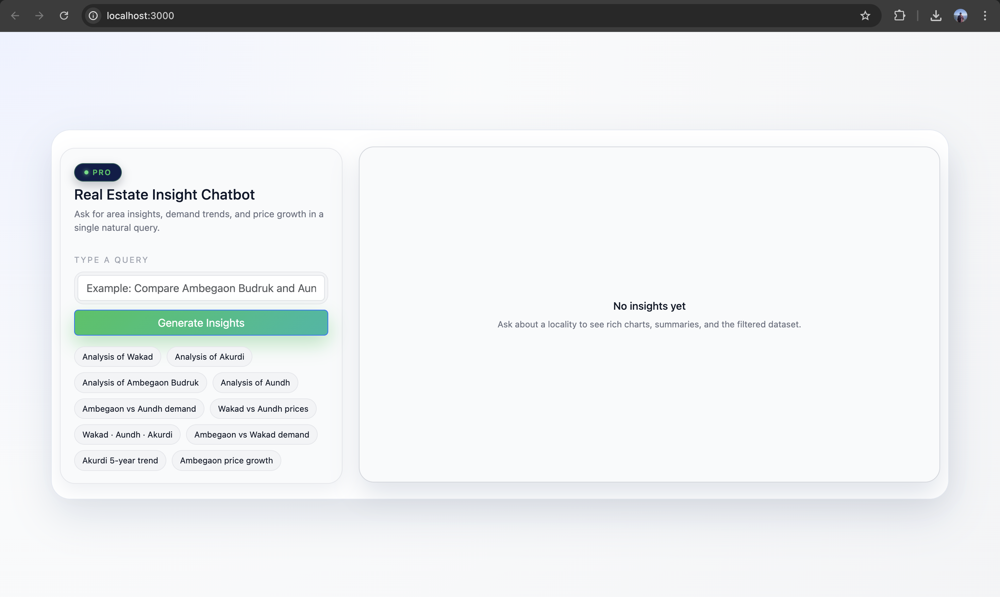

# Real Estate Insight Chatbot (Django + React + OpenAI)

A full-stack AI-powered real-estate analysis chatbot built using **Django**, **React**, **Pandas**, **Recharts**, and **OpenAI**.

---

## 🌐 Live Website  
👉 **https://real-estate-insight-frontend.onrender.com**

---

## ⭐ Features

### 🔹 1. Chat-based Query Interface  
Users can type natural-language queries about Pune localities, such as:

- "Give me analysis of Wakad"  
- "Compare Ambegaon Budruk and Aundh demand trends"  
- "Which locality has higher demand between Ambegaon Budruk and Wakad?"

---

### 🔹 2. Excel-Based Dataset Processing  
The backend processes the provided Excel sheet and extracts:

- Locality name  
- Year-wise price & demand  
- Average rates  
- Sales & demand indicators  
- Trend-based insights  

---

### 🔹 3. AI-Powered Insight Generation  
Summary text is generated using **OpenAI GPT-5.1-mini**, producing:

- Human-like natural summaries  
- Comparisons across multiple localities  
- Trend analysis  

---

### 🔹 4. Interactive Trend Charts  
Using Recharts, the app displays:

- Year-wise average price  
- Year-wise demand indicators  
- Multi-locality line chart comparison  

---

### 🔹 5. Filtered Dataset Table + CSV Download  
Displays all relevant Excel rows for the query, with:

- Clean structured table  
- Proper spacing  
- Column alignment  
- Downloadable CSV  

---

## 📸 Screenshots  
Images located in the `/Image` folder.

### 📌 Dashboard View  


### 📌 Example Query: “Give me analysis of Wakad”  


### 📌 Locality Comparison  


### 📌 Filtered Dataset  


---

## 🚀 Running Locally

### 1️⃣ Backend (Django)

```bash
cd backend
python3 -m venv venv
source venv/bin/activate
pip install -r requirements.txt

export OPENAI_API_KEY="your_api_key_here"
python3 manage.py migrate
python3 manage.py runserver
```

---

### 2️⃣ Frontend (React)

```bash
cd frontend
npm install
npm start
```

---

## 📦 Project Structure

```
realestate_chatbot_pro/
│
├── backend/
│   ├── api/
│   ├── core/
│   └── sample_data.xlsx
│
├── frontend/
│   ├── src/components/
│   ├── src/styles.css
│   └── public/
│
└── Image/
```

---

## ✔️ Feature Checklist

| Feature | Implemented |
|--------|-------------|
| Chat UI | ✅ |
| Query Parsing | ✅ |
| Excel Processing | ✅ |
| Insight Summary | ✅ |
| Trend Chart | ✅ |
| Filtered Table | ✅ |
| CSV Download | ✅ |
| LLM Integration | ✅ |
| **Live Website** | **✅ https://real-estate-insight-frontend.onrender.com** |

---

